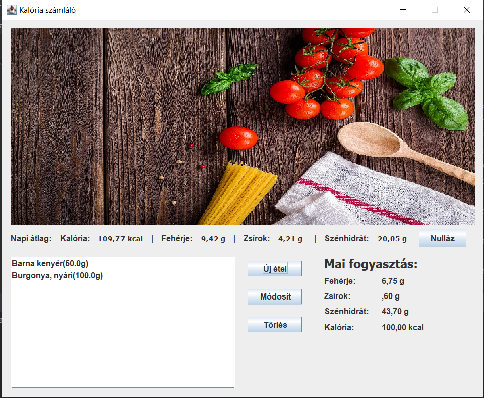

# Calorie Calculator
Calorie Calculator is a java standalone application helping to plan and monitor your nutrition.

## General Information
- The project uses an SQLite database to store different foods.
- You can pick different foods, store them and monitor their nutritional values

## Screenshots

## Technologies Used
- Java - version 17
- SQLite
- mysql-connector-java 8.0.21
- Java SWING

## Project Status
Project is: _complete_

## Room for Improvement

To do:
- Installing guide.

